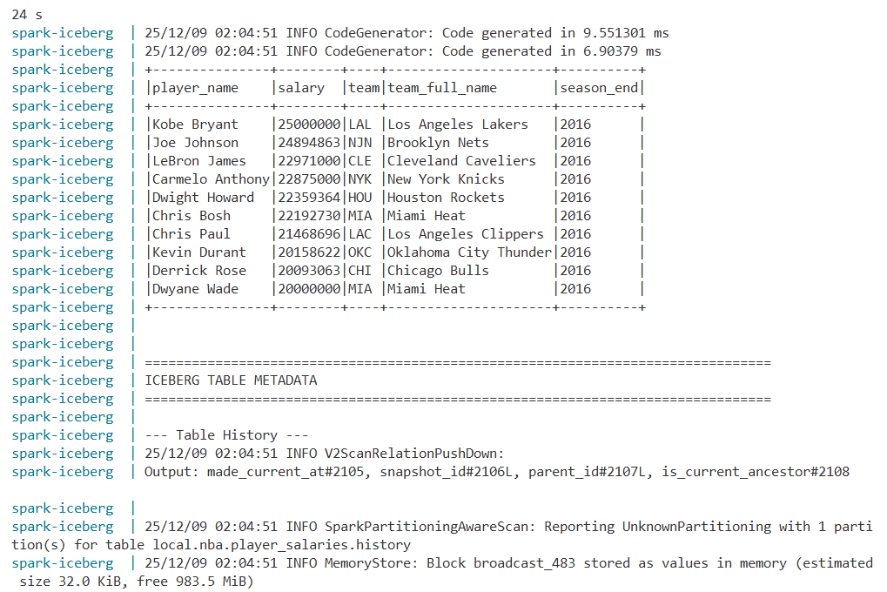

# Lab 5: Apache Iceberg с PySpark

## Описание

Загрузка данных о зарплатах NBA игроков (1991-2018) в таблицу Apache Iceberg с использованием MERGE INTO для обновления существующих записей.

## Запуск

```powershell
# Из корня проекта
docker compose -f docker-compose-lab5.yml up --build
```

### Результаты

После выполнения:
1. Все данные загружены в Iceberg таблицу `local.nba.player_salaries`
2. Показаны данные за 2016 год
3. Выведены ТОП-10 самых высокооплачиваемых игроков 2016 года
4. Метаданные Iceberg находятся в `data/lab5/warehouse/nba/player_salaries/metadata/`

```sql
CREATE TABLE local.nba.player_salaries (
    player_name STRING,
    salary BIGINT,
    season_start INT,
    season_end INT,
    team STRING,
    team_full_name STRING
)
USING iceberg
PARTITIONED BY (season_end)
```

При загрузке каждого года используется MERGE INTO:
- Если игрок с таким же `player_name`, `season_end` и `team` уже есть - обновляем запись
- Если нет - вставляем новую запись

После загрузки данных в `warehouse/nba/player_salaries/metadata/` будут:
- `*.metadata.json` - метаданные таблицы
- `snap-*.avro` - снапшоты (по одному на каждую операцию merge)
- `*.avro` - манифесты файлов данных

